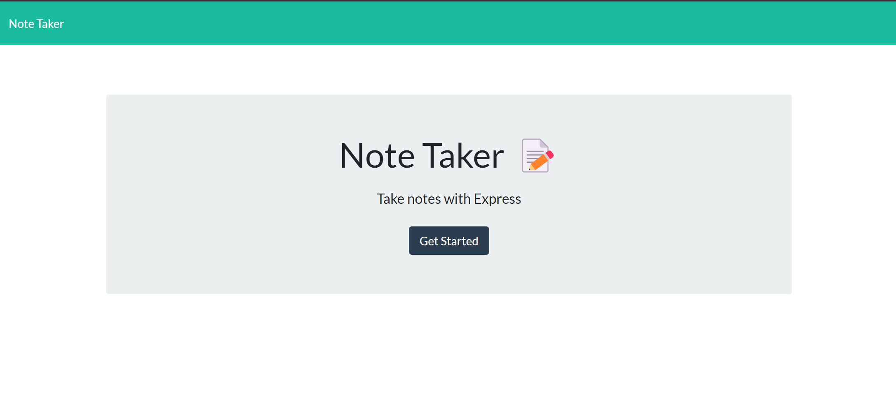
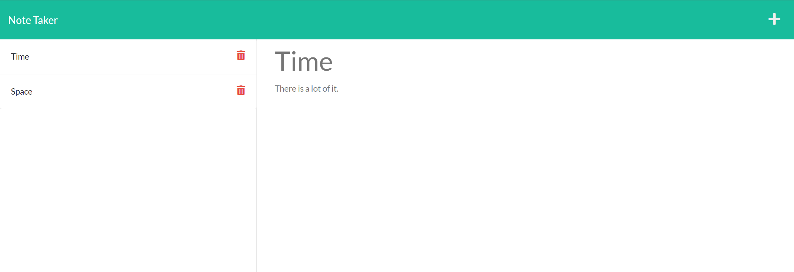

# Note-Taker Application!

## License:

- 
- https://opensource.org/licenses/MIT

## Table of contents:

- [License](#license)
- [Description](#description)
- [Installation](#installation)
- [Usage](#usage)
- [Contributing](#contributing)
- [Tests](#tests)
- [Questions](#questions)

## Description:

Take detailed notes and continue to be more organized!

## Installation:

Just npm start and then you can access the webpage. Once there just type in your title and note details and then hit the save icon in the top right hand corner! If you we viewing an existing note just click on the + symbol in the top right hand corner and it will take you to a new note!

## Usage:

Inteded usage is very similar to sticky notes! Sometimes you need to keep a certain peice of information that can be easily recalled.

## Contributors:

Darin Palombo

## Tests:

No tests needed!

# Questions:

## Reach out to me through Github for any questions:

https://github.com/Darin1027

## Or check out the repo containing the code to the Note-Taker

https://github.com/Darin1027/Note-Taker

## Or send an email if that is your preferred method of communication:

dplb1027@gmail.com

## Link to sample deployed Note-Taker video:

## Screenshots of deployed Note-Taker:

- 

- 
